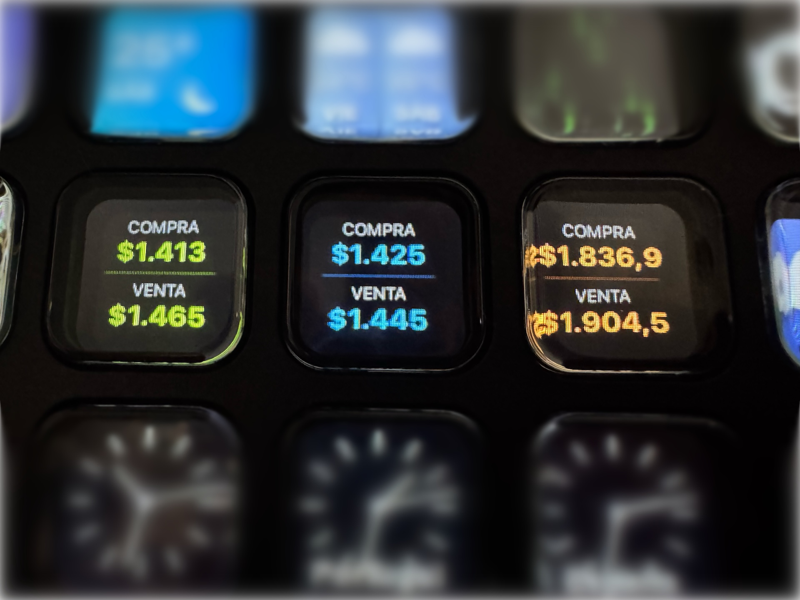

# CalculaDólar para Stream Deck

## ¿Qué hace?

Este plugin te permite:

- Agregar los distintos tipos de cotizaciones del dólar en Argentina a tu Deck.
- Abrir [CalculaDólar](https://calculadolar.wenoa.studio) al presionar una tecla.

## ¿Cómo lo instalo?

### Desde el Marketplace de Elgato

1. Abrir [CalculaDólar en StreamDeck](https://marketplace.elgato.com/product/calculadolar-fbdcd484-3d5b-4114-b449-3cd1edeadd94).
2. Seguir los pasos de instalación.

### Manualmente

1. Descargar el archivo `.streamDeckPlugin` desde [Releases](https://github.com/wenoa/calculadolar-deck/releases).
2. Hacer doble clic en el archivo descargado.
3. Stream Deck instalará el plugin automáticamente.

## ¿Encontraste algún problema?

Abrí un issue o, mejor aún, enviá un pull request.

---

Hecho con ♥️ en [Wenoa Studio](https://wenoa.studio)
